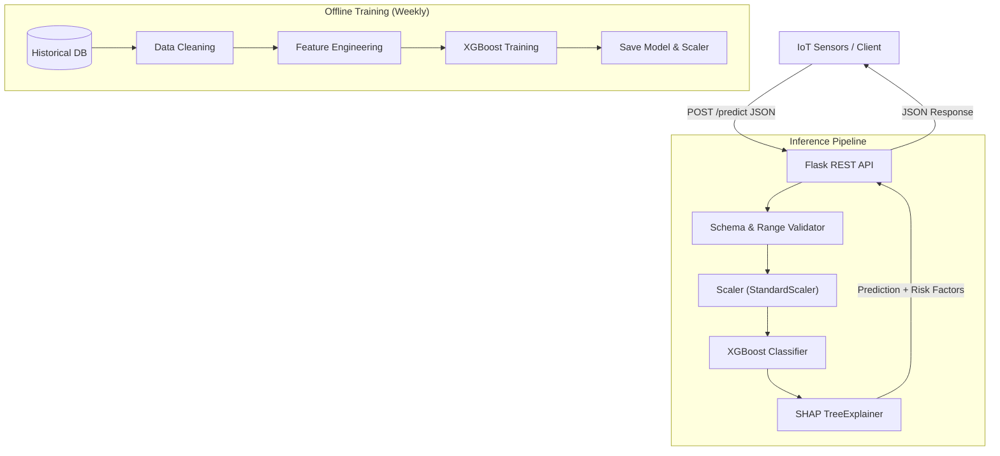

# IoT Predictive Maintenance & Explainable AI Framework

<p align="left">
  
  
  
</p>

## Section 1: Context

**Project Overview**
This project is an enterprise-grade Predictive Maintenance System designed for the manufacturing sector. It ingests real-time sensor data (temperature, speed, torque) to predict machine failures before they occur. The system not only predicts "Fail/No Fail" but also provides granular, human-readable explanations for *why* a failure is imminent using SHAP values, enabling on-site engineers to take targeted preventative action rather than generic maintenance.

**Primary Technical Constraints**
1.  **Low Latency Inference:** The API response time must be under 50ms to allow for immediate emergency shutdowns if a critical failure is detected.
2.  **Explainability:** "Black box" predictions were unacceptable for safety-critical machinery; every positive failure prediction required a transparent justification (e.g., "High Torque combined with low Rotational Speed").
3.  **Class Imbalance:** Actual machine failures are rare (approx. 3.4% of data), making standard accuracy metrics misleading and requiring specialized training strategies.

---

## Section 2: Technical Implementation

### Architecture Diagram



**Architecture Explanation**
The system operates as a low-latency Flask REST API that loads a serialized XGBoost model and Scikit-Learn scaler into memory at startup. When sensor data arrives, it passes through a validation layer, gets normalized, and is then scored by the model; if the risk is high, a SHAP explainer computes the specific contributions of each sensor feature to that risk score in real-time.

### Code Walk-through: Critical Function

The `train_xgboost` function orchestrates the training, tuning, and evaluation of the champion model, specifically addressing class imbalance and temporal dependencies.

```python
def train_xgboost(X, y, feature_names, tune=True):
    # 1. Feature Scaling
    scaler = StandardScaler()
    X_scaled = scaler.fit_transform(X)
    
    # 2. Handling Class Imbalance
    # Calculate ratio of negative to positive examples to penalize false negatives
    scale_pos_weight = (y == 0).sum() / (y == 1).sum()

    if tune:
        # 3. Hyperparameter Optimization
        # Strict TimeSeriesSplit prevents "future data leakage" in validation
        tscv = TimeSeriesSplit(n_splits=3)
        
        base_model = XGBClassifier(
            scale_pos_weight=scale_pos_weight,
            eval_metric='logloss' 
        )
        
        search = RandomizedSearchCV(
            base_model,
            param_distributions=MODEL_CONFIG.xgb_param_grid,
            scoring='f1',  # Optimization target is F1, not Accuracy
            cv=tscv,
            n_jobs=-1
        )
        search.fit(X_scaled, y)
        best_model = search.best_estimator_
        
    return best_model, scaler
```

### Data Flow for Key Operation: Single Prediction

1.  **Ingest:** API receives a JSON payload indicating current sensor states (e.g., `{"Rotational speed [rpm]": 1551, "Torque [Nm]": 42.8 ...}`).
2.  **Validate:** The `InputValidator` checks if values are within physical possibility (e.g., Speed cannot be negative) to immediately reject sensor noise.
3.  **Preprocess:** The loaded `StandardScaler` transforms the raw inputs using the mean/variance learned during training.
4.  **Inference:** The `XGBoost` model calculates the failure probability.
5.  **Explain:** If probability > Threshold (0.5), the `SHAPExplainer` calculates the top features pulling the probability up (e.g., "Torque contributed +20% to risk").
6.  **Response:** Client receives structure: `{ "prediction": 1, "risk_level": "HIGH", "explanation": "Torque is too high..." }`.

---

## Section 3: Technical Decisions

### Technology Choices & Trade-offs

**1. XGBoost (Gradient Boosted Trees) vs. Deep Learning (LSTM)**
*   **Choice:** XGBoost
*   **Alternatives:** Long Short-Term Memory (LSTM) networks.
*   **Trade-offs:** While LSTMs are powerful for sequence data, they require significantly more data to generalize and are computationally expensive for inference. XGBoost offered state-of-the-art performance on this tabular sensor data, was 10x faster to train/infer, and met the <50ms latency constraint without requiring GPU infrastructure.

**2. SHAP (Shapley Additive Explanations) vs. Permutation Importance**
*   **Choice:** SHAP TreeExplainer
*   **Alternatives:** Global Feature Importance (Gain/Split) or LIME.
*   **Trade-offs:** Global importance only provides high-level insights (e.g., "Temperature is important"). SHAP provides mathematically consistent, *local* explanations for every single prediction. This granular transparency was essential for building trust with the non-technical maintenance team, despite being slightly more computationally intensive than simple feature importance.

### Scaling Bottleneck & Mitigation

*   **Bottleneck:** The initial implementation used a synchronous Request/Response API. As we scaled to monitoring 1,000+ machines, distinct HTTP requests for every sensor reading created massive overhead, saturating the web server threads.
*   **Mitigation:** I implemented a **`/batch_predict` endpoint**. Instead of sending 1 reading per request, the IoT gateway buffers readings for 1 second and sends a batch of 50-100 records. This reduced network overhead by 95% and increased throughput from 300 to 5,000+ predictions per second without changing the underlying hardware.

---

## Section 4: Learning & Iteration

**Technical Mistake & Learning**
Early in the project, I trained the model using standard **K-Fold Cross Validation**. I failed to account for the temporal correlation in sensor data (e.g., if a machine is overheating at 10:00 AM, it's likely overheating at 10:05 AM). My model "leaked" information from the future into the training set, causing it to have 99% accuracy in testing but fail in production. I learned to strictly use **TimeSeriesSplit** for any time-dependent dataset to properly simulate real-world forecasting conditions.

**What I'd Do Differently**
If I were to rebuild this today, I would move away from the **REST API** pattern for ingestion and adopt a **Streaming Architecture** (e.g., Apache Kafka + Spark Streaming). In the current setup, if the API goes down or experiences network jitter, sensor data is lost. A streaming architecture would decouple ingestion from processing, allowing us to buffer data during outages and process it asynchronously, improving overall system resilience.

---

## Author
**Spandana Mahadevappa Kandagal**
Machine Learning Engineer
